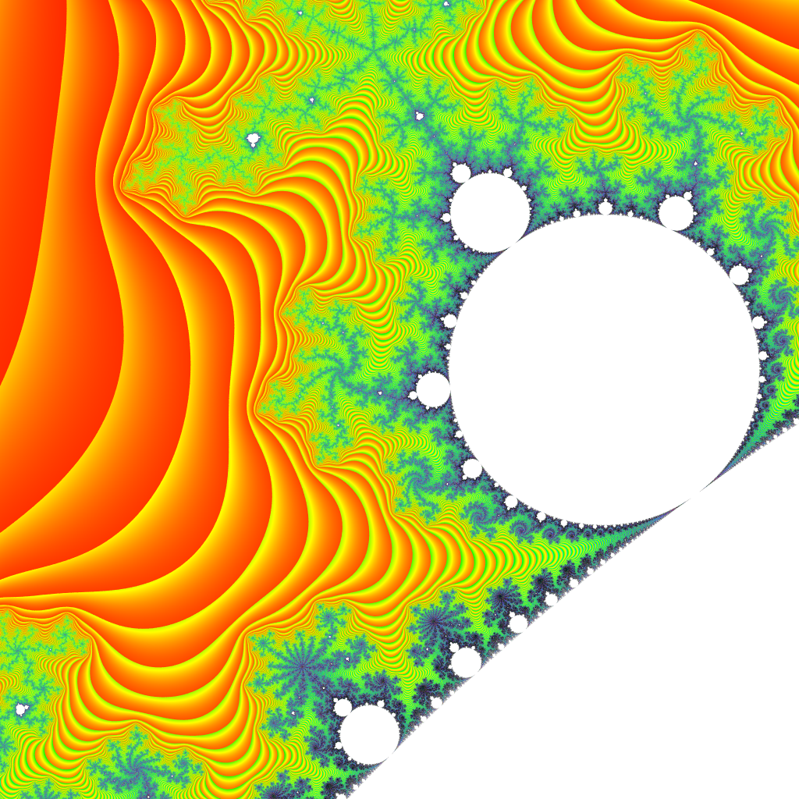

# fractal-generator
Generates a [Mandelbrot set](https://en.wikipedia.org/wiki/Mandelbrot_set) image. Built using
[Rust](https://www.rust-lang.org/).

## Usage
```shell
cargo run --release -- --help
```

## Example
An example generated with the default parameters can be seen below.


## Ideas for Improvement
- Utilise the GPU
- Webpage (WASM?)
